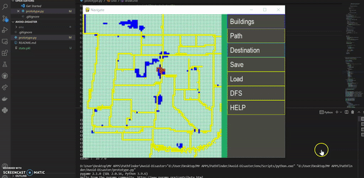

# Avoid-Disaster

> ## 🥉 Secured 2nd Runner Up Position.

 

* This project demonstrates how to smartly manage a large-scale disaster (ex 19|11 attacks ). 
* This is a concept that considers factors such as injured individuals, rescue teams, and people who are unaware of the threat and locates the safest zones, such as hospitals, and distributes the injured into them. 
* It is like Google Maps but the main difference is that" Google Map will show the same routes to all the people trying to escape that place while we will distribute the population based on the availability of space and considering the route of every individual.

---

 

A prototype that focuses on reducing the number of casualties and helping out people in case of a large scale devastation.

 

<a href="https://devfolio.co/submissions/linedge-4e41"><h2>Checkout on Devfolio</h2></a>

